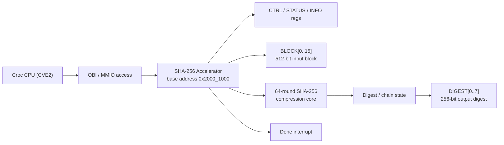

# SHA-256 Accelerator Project Outline

## Project Idea

We extend the Croc SoC with a SHA-256 hardware accelerator in the `user_domain`.
The goal is to improve the base design with a useful cryptographic primitive that is
faster than the software-only baseline while fitting into the Croc SoC flow used in
VLSI2. The accelerator is exposed as a memory-mapped peripheral so that the existing
RISC-V core can control it through simple register reads and writes.

## Motivation

SHA-256 is a realistic accelerator target because it is computation-heavy, easy to
verify against standard test vectors, and representative of the kind of structured
datapath that benefits from hardware acceleration. This makes it a good fit for the
course goal of starting from Croc and improving it in a meaningful, measurable way.

## Block Diagram

## Current Architecture

- `CTRL.START` launches a SHA-256 compression.
- `CTRL.CHAIN` continues hashing from the previous digest state for multi-block messages.
- `STATUS` reports `READY`, `BUSY`, `DONE`, `DIGEST_VALID`, `IRQ_PENDING`, and `START_ERR`.
- Software currently performs message padding and writes 16 input words into the
  accelerator for each 512-bit block.

## Improvement Over Base Croc

- Adds a new user-domain accelerator instead of leaving Croc as a CPU-only platform.
- Demonstrates a measurable performance improvement on SHA-256 workloads.
- Exercises hardware/software co-design: RTL integration, MMIO programming model,
  bare-metal driver support, and SoC-level verification.

## Evaluation Plan

- Functional correctness:
  verify against standard SHA-256 test vectors in Verilator.
- Multi-block behavior:
  verify correct digest chaining across consecutive blocks.
- Performance:
  compare hardware cycle count against a software-only SHA-256 baseline.
- Physical-design readiness:
  synthesize the design, inspect area/timing impact, and later run the full
  backend flow toward DRC/LVS-clean implementation.

## Current Status

- Single-block SHA-256 path is implemented and verified.
- Multi-block chained hashing is implemented and verified.
- A benchmark already shows a hardware speedup of about `14.4x` over the software
  baseline on the current one-block `"abc"` case.

## Planned Next Steps

1. Run synthesis and collect area/timing numbers for the accelerator.
2. Decide whether padding remains in software or moves partly into hardware.
3. Add interrupt-driven software support and, if useful, more system-level demos.
4. Prepare the final report with architecture, evaluation, and physical-design results.
